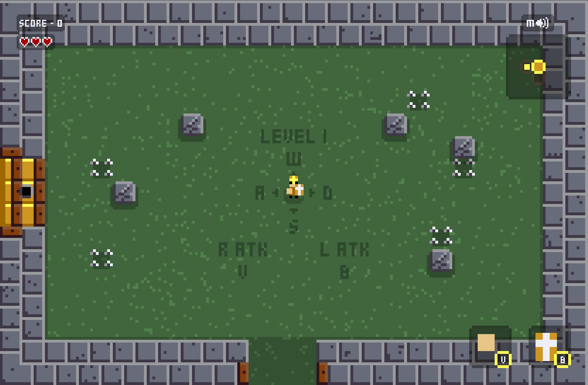

# The Knighting of Sr Isaac

Is a simple random room generated roguelike game where you combine different weapons with unique attack patterns against enemies.

Prove yourself worthy of being called a knight and see how far you can go!!!

You can play a live version here: https://igorfie.gitlab.io/the-knighting-of-sr-isaac/

This game was created for the [2023 js13kGames](https://js13kgames.com/) where the theme was `13TH CENTURY`.

### Game instructions
- w/a/s/d to walk and v/b to attack on desktop.
- Gamepad and atk buttons a/b for mobile. 
- Pick your starting weapon with v/b in the keyboard or press the buttons in mobile.
- v/b or a/b allows you to pick a weapons to that respective hand, it also allows you to open doors.
- Treasure room can only be opened if you have the key.
- Clicking in the top right speaker or pressing "m" can mute the game sounds.
- Enemies may drop their weapons after dead.

## Weapons in game

### Close Melee:
- Fist: down atk
- Shield: down-side atk, pushes enemies down
- Axe: down-side atk
- Morning Star: side atk
- Hammer: top-side atk
- Sword: top-side-down atk

### Long Range Melee:
- Spear: down atk
- Greatsword: 360 atk
- Halberd: top atk

### Range:
- Trowing Knives: down-side atk
- Trowing Axe: side atk
- Crossbow: top-side atk

## Enemy Behaviours
- Afraid: keeps himself at a distance from the player, if player gets close they run away.
- Agressive: follows the player and attacks.
- Defensive: gets close to player but keeps a distance to perform attacks.

## TODO-FOR-FUTURE-ME
Since the limit of space was 13kbs I was out of space but in the future I may:
- Implement A* algorithm for the enemies to walk.
- Implement armor items so player/enemeis can have an aditional shield "life" bar wich takes damage before the player/enemies real life.
- Implemente general rougelike items to increase player life, atk base dmg, defence, etc.
- Implemente more environment traps and sprites, like trees, bear traps, wood walls, etc.
- Investigate a strange performance problem where the game slows down, can't figure out if it's due to the animation system used. It doesn't seem to be a memory leak, maybe garbage collector... But memory seems to be cleaned normally without causing issues... I have no idea. Maybe it's a problem with my machine since people don't seem to have the same issue.

### Setup
Run `npm install` on a terminal

### Development
Run `npm run start` to start the game in a development server on `localhost:8080`.

### Production
Use `npm run build` to create minified file and zip him with the `index.html`. The result will be available in the `build` directory.